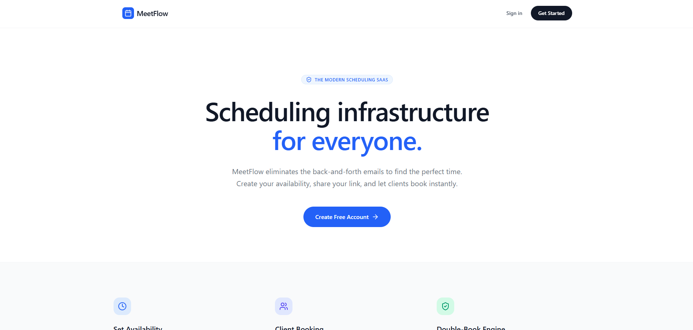
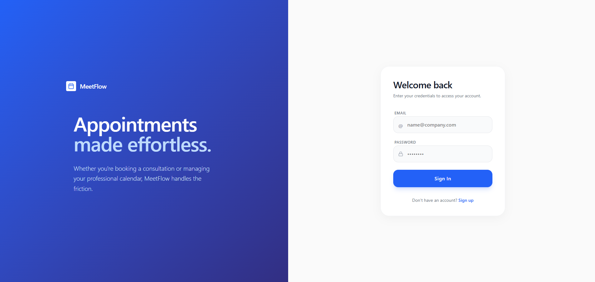

# MeetFlow SaaS 🗓️

MeetFlow is a modern, full-stack appointment scheduling platform designed to eliminate the back-and-forth emails of finding the perfect meeting time. Built as a lightweight clone of Calendly, it features robust back-end scheduling logic, role-based dashboards, and a clean interface.

## 🚀 Key Features

- **Public Booking Pages (`/u/:username`)**: Professionals get a personalized, shareable booking link.
- **Smart Grid Generation**: Automatically generate availability slots over date ranges using set durations (15m, 30m, 60m).
- **Double-Booking Prevention**: Built-in transactional logic at the database level ensures no two clients can book the exact same slot.
- **Role-Based Access**: 
  - **Professionals**: Manage availability, view upcoming appointments, mark "no-shows", and track analytics.
  - **Clients**: Browse the professional directory, book available slots, and cancel appointments.
- **Analytics Dashboard**: Insights on total bookings, open slots, and no-show clients.
- **Simulated Notification System**: Ready-to-connect email notification hooks for bookings and cancellations.

## 📸 Screenshots


| Landing Page  |
|:---:|
|   |

|Login Session |
|:---:|
|  |


## 💻 Tech Stack

- **Frontend**: React 19, TypeScript, Vite, Tailwind CSS v4, Lucide React, React Router.
- **Backend**: Node.js, Express.js, TypeScript.
- **Database**: SQLite (via `better-sqlite3`).
- **Security**: JWT Authentication, `bcryptjs` for secure password hashing.

## 📂 Project Structure

```text
├── backend/
│   ├── db.ts          # SQLite database schema and initialization
│   ├── routes.ts      # Express REST API routes (Auth, Slots, Appointments, Analytics)
│   └── server.ts      # Express server setup and Vite middleware
├── src/
│   ├── components/    # Reusable UI components
│   ├── context/       # React Context (e.g., AuthProvider)
│   ├── lib/           # Utilities and API fetch wrappers
│   ├── pages/         # Application Views (Landing, Login, Dashboard, PublicProfile, Booking)
│   ├── App.tsx        # Router setup
│   └── main.tsx       # React entry point
├── .env.example       # Example environment variables
└── package.json       # Project dependencies and scripts
```

## 🛠️ Getting Started

### Prerequisites

- [Node.js](https://nodejs.org/) (v18+ recommended)
- npm

### Installation

1. **Clone the repository**
   ```bash
   git clone https://github.com/yourusername/meetflow-saas.git
   cd meetflow-saas
   ```

2. **Install dependencies**
   ```bash
   npm install
   ```

3. **Set up environment variables**
   Copy the example environment file and set your custom variables (like your `JWT_SECRET`).
   ```bash
   cp .env.example .env
   ```

4. **Run the development server**
   ```bash
   npm run dev
   ```
   The application will start concurrently (Vite frontend + Express backend) and will be accessible at `http://localhost:3000`. 
   
   *Note: SQLite will automatically initialize the database `app.db` on your first launch.*

## 🔒 Security & Backend Logic

- **Authentication**: Stateless JWT token authentication passed via the `Authorization: Bearer <token>` header.
- **Transactions**: Booking an appointment triggers a `db.transaction()` that verifies slot availability (`is_booked = 0`), updates the slot to booked, and inserts the appointment record sequentially to prevent race conditions.

## 📝 License

This project is open-source and available under the [MIT License](LICENSE).
